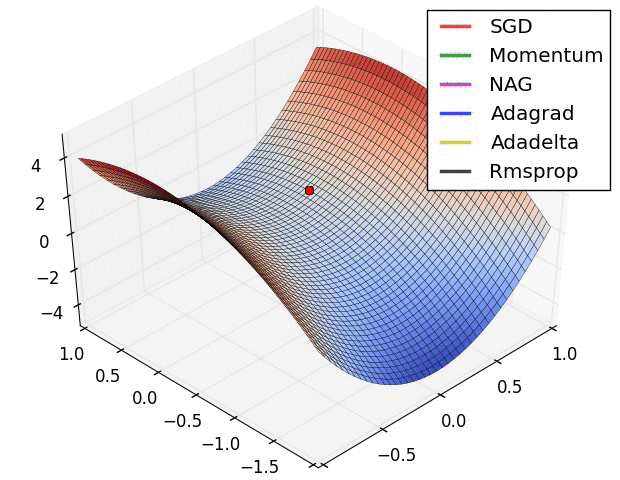

# Artificial-Intelligence
The AI-Project with Machine Learning and Deep Learning

## Part1. Alogrithm : 

## Part2. Deep Learning Project : 

<Main> :
- CNN : Image Classification.
- RNN : Stock Prediction.
- NLP : Pipeline from Word Vector to text classfication.

